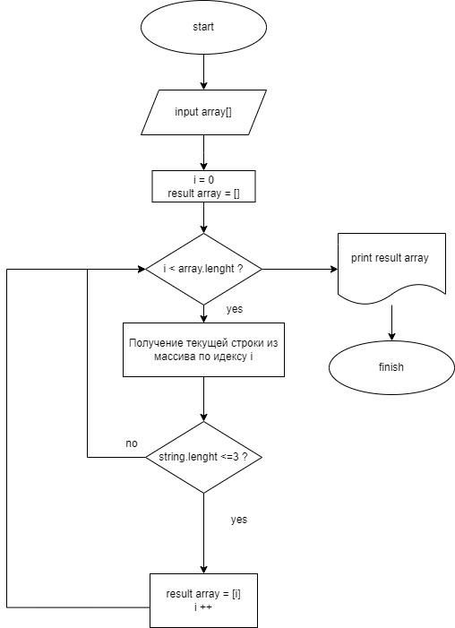
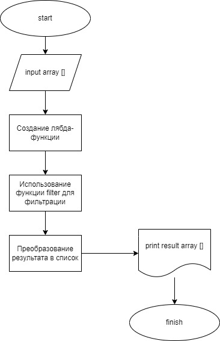

# Решение задачи

1. Написал "пустую" функцию **filter_strings** и запрос у пользователя ввода массива через пробел.  
2. Написал саму функцию с использованием цикла.  
3. Подумал и решил использовать вместо цикла **лямбда-функцию**, которая уже возвращает отсортированный список, отвечающий требованию задачи.  
4. Сделал пару тестов и программа работает ***отлично!***

## Блок схема для цикла for ##

## Блок схема для лямбда функции ##

